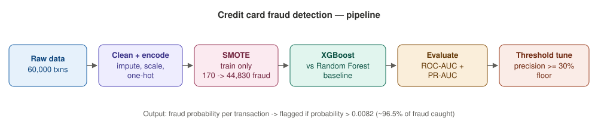
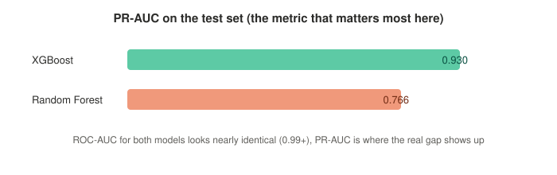

# Credit Card Fraud Detection

Flags fraudulent transactions in a dataset where only 0.38% of transactions are actually fraud, and tunes the decision threshold around how many false alarms a review team could realistically handle in a day.



## The problem

Fraud is rare. That sounds like good news but it makes the problem harder to evaluate, not easier. A model that just predicts "not fraud" every single time would still be right 99.6% of the time while catching zero fraud. So the real challenge isn't training a classifier, it's evaluating and tuning one without getting fooled by how lopsided the data is.

## Data

Synthetic transaction data (`data/transactions.csv`, 60,000 rows): ten anonymized behavioral features (V1 to V10), transaction amount, merchant category, channel, distance from home, distance from the last transaction, and how unusual the amount is compared to that cardholder's normal spending. Only about 70% of the fraud cases carry an obvious signal, the rest are meant to be hard to catch, so the model can't just memorize an easy pattern.

## Approach

1. **Clean and preprocess**: impute missing values, `StandardScaler` on numeric columns, `OneHotEncoder` on categorical ones.
2. **75/25 stratified split**, so the train and test sets both keep the real 0.38% fraud rate.
3. **SMOTE, applied to the training set only**: generates new synthetic fraud examples by interpolating between real ones, taking training data from 170 fraud vs 44,830 legit to a balanced 44,830 vs 44,830. The test set is left completely untouched, so evaluation still reflects real conditions.
4. **Two models trained and compared**: XGBoost as the main model, Random Forest as a baseline.
5. **Evaluated on ROC-AUC and PR-AUC**, not just ROC-AUC. On data this imbalanced, ROC-AUC alone can look great while hiding a model that isn't actually catching much fraud.
6. **Threshold tuned to a business rule**: lowest threshold that still keeps precision at or above 30%, roughly two false alarms for every real fraud caught, instead of the default 0.5.

## Tools

Python, pandas, scikit-learn, XGBoost, imbalanced-learn (SMOTE), matplotlib.

## Results



| Metric | XGBoost | Random Forest |
|---|---|---|
| ROC-AUC | 0.992 | 0.997 |
| PR-AUC | 0.930 | 0.766 |

ROC-AUC alone makes Random Forest look slightly better. PR-AUC tells the opposite story, which is exactly why it was chosen as the model to go with.

At the tuned threshold of 0.0082:
- Caught 55 of 57 fraud cases in the test set, about 96.5% recall
- 128 false alarms out of 14,943 legitimate transactions, landing right around the 30% precision target

## Repo structure

```
src/generate_data.py   builds the synthetic dataset
src/train.py            cleaning, SMOTE, training, evaluation, threshold search
data/                    the generated dataset
notebooks/               exploratory analysis
outputs/                 metrics, trained model, plots
```

## Running it

```bash
pip install -r requirements.txt
python src/generate_data.py
python src/train.py
```
