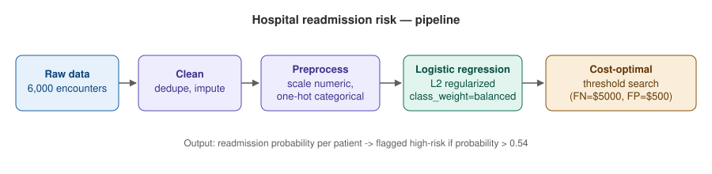

# Hospital Readmission Risk

Predicts whether a patient will be readmitted within 30 days of discharge, and turns that prediction into an actual staffing decision using a cost-based threshold instead of the default 0.5 cutoff.



## Problem

Hospitals lose money and patients suffer worse outcomes when a preventable readmission is missed. But flagging every patient as "high risk" isn't free either — every flag means a follow-up call or home visit. The real question isn't just "who might be readmitted," it's "who is it worth intervening for."

## Data

Synthetic patient encounter data (`data/patient_encounters.csv`, 6,000 rows) with vitals, prior admission history, diagnosis, discharge details, and insurance type. Generated with realistic correlations (e.g. more prior admissions -> higher readmission odds), and with missing values and duplicates injected on purpose so the cleaning step does real work.

## Approach

1. **Clean** — drop duplicates, impute missing values (median for numeric, `"Unknown"` for categorical).
2. **Preprocess** — `StandardScaler` on numeric features, `OneHotEncoder` on categorical features, wrapped in an sklearn `Pipeline`.
3. **Model** — L2-regularized logistic regression with `class_weight="balanced"` (readmission is only ~10% of cases). Compared against an unregularized baseline.
4. **Decision layer** — instead of stopping at a probability, the model's output is passed through a cost sweep: every threshold from 0.01 to 0.99 is scored against `cost = FP x $500 + FN x $5,000`, and the threshold with the lowest expected cost is chosen.

## Tools

Python, pandas, scikit-learn (`LogisticRegression`, `Pipeline`, `ColumnTransformer`), matplotlib for plots, joblib for model persistence.

## Results

| Metric | Value |
|---|---|
| ROC-AUC (L2) | 0.673 |
| ROC-AUC (unregularized) | 0.674 |
| Default threshold (0.5) expected cost | $549,500 |
| Cost-optimal threshold | **0.54** |
| Expected cost at optimal threshold | **$539,000** |

Choosing the threshold by cost instead of defaulting to 0.5 saves roughly **$10,500** in expected cost on the test set (1,500 patients), without changing the model itself — just the decision rule applied to its output.

## Repo structure

```
src/generate_data.py   synthetic data generator
src/train.py            cleaning, preprocessing, training, threshold search
data/                    generated dataset
notebooks/               exploratory analysis
outputs/                 metrics, trained model, plots
```

## Running it

```bash
pip install -r requirements.txt
python src/generate_data.py
python src/train.py
```
