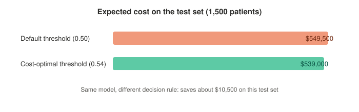

# Hospital Readmission Risk

Predicts whether a patient will be readmitted within 30 days of being discharged, and uses that prediction to decide who actually needs a follow up call, based on cost, not on a default cutoff.


## The problem

A missed readmission is expensive and bad for the patient. But calling every single discharged patient "just in case" isn't free either, someone has to make that call. So the real question isn't only "who might come back", it's "who is worth reaching out to given what a mistake actually costs."

## Data

Synthetic patient encounter data (`data/patient_encounters.csv`, 6,000 rows): vitals, prior admission history, diagnosis, discharge details, insurance type. I generated it myself with realistic patterns baked in (more prior admissions pushes readmission risk up), and added missing values and duplicate rows on purpose so the cleaning step isn't skipped.

## Approach

1. **Clean the data**: drop duplicates, fill missing values (median for numeric columns, "Unknown" for categorical ones).
2. **Preprocess**: `StandardScaler` for numeric features, `OneHotEncoder` for categorical ones, all wrapped in an sklearn `Pipeline` so training and inference stay consistent.
3. **Train the model**: L2 regularized logistic regression with `class_weight="balanced"`, since readmission only happens in about 10% of cases. Also trained an unregularized version to compare.
4. **Pick a threshold that means something**: swept every threshold from 0.01 to 0.99 and scored each one against `cost = FP x $500 + FN x $5,000`, then picked the one with the lowest expected cost.

## Tools

Python, pandas, scikit-learn (`LogisticRegression`, `Pipeline`, `ColumnTransformer`), matplotlib, joblib.

## Results



| Metric | Value |
|---|---|
| ROC-AUC (L2) | 0.673 |
| ROC-AUC (unregularized) | 0.674 |
| Default threshold (0.5) expected cost | $549,500 |
| Cost-optimal threshold | 0.54 |
| Expected cost at optimal threshold | $539,000 |

Same model, different decision rule, and it saves roughly $10,500 in expected cost on the 1,500 patient test set. Regularization didn't move the AUC much here, its real job is keeping the model stable, not squeezing out extra accuracy.

## Repo structure

```
src/generate_data.py   builds the synthetic dataset
src/train.py            cleaning, preprocessing, training, threshold search
data/                    the generated dataset
notebooks/               exploratory analysis
outputs/                 metrics, trained model, plots
```

## Running it

```bash
pip install -r requirements.txt
python src/generate_data.py
python src/train.py
```
